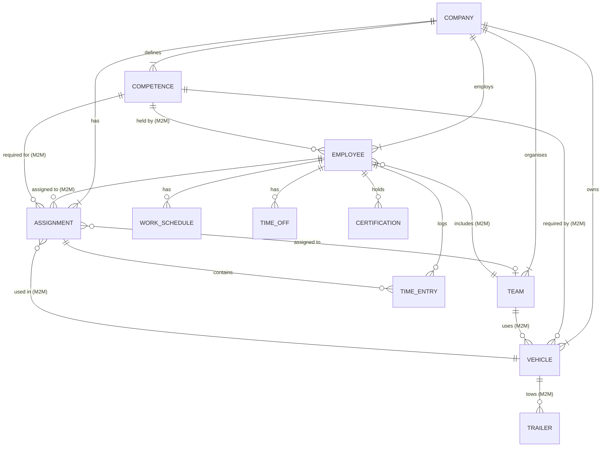

# Datamodell — Ressursplanlegger

> **Owner: Embret** — filled based on `prisma/schema.prisma`.
> Used when writing Chapter 4.4 (System Description).

---

## Entities

### Assignment (Oppdrag)
| Field | Type | Description |
|-------|------|-------------|
| id | UUID | Primary key |
| customer | String | Customer name |
| project | String | Project/job name |
| description | String? | Free-text description |
| location | String? | Location or address |
| startDate | DateTime | Assignment start date |
| endDate | DateTime | Assignment end date |
| startTime | String? | Start time (HH:MM) |
| endTime | String? | End time (HH:MM) |
| status | Enum | planned / approved / in_progress / completed / cancelled |
| color | String? | Display colour on timeline |
| isRecurring | Boolean | Whether this is a recurring assignment |
| recurringPattern | Enum? | daily / weekly / biweekly / monthly |
| recurringEndDate | DateTime? | End of recurring series |
| requiredVehicleType | String? | e.g. "truck", "van" |
| priority | Enum | low / medium / high |
| estimatedHours | Float? | Estimated work hours |
| replacementNote | String? | Note for sick-leave replacements |
| teamId | String? | FK → Team (optional fixed crew) |
| companyId | String | FK → Company (tenant scope) |

### Employee (Ansatt / Sjåfør)
| Field | Type | Description |
|-------|------|-------------|
| id | UUID | Primary key |
| name | String | Full name |
| role | String? | Job title / role |
| department | String? | Department |
| phone | String? | Phone number |
| email | String? | Email address |
| availability | Int | Availability percentage (0–100) |
| workHoursPerWeek | Float? | Contracted hours per week |
| employmentPercentage | Float? | Employment fraction (e.g. 100 = full-time) |
| assignedVehicleId | String? | FK → Vehicle (driver's default vehicle) |
| driverLicenseExpiry | DateTime? | Expiry of driving licence |
| utilization | Float? | Calculated utilisation percentage |
| companyId | String | FK → Company |

### Vehicle (Kjøretøy)
| Field | Type | Description |
|-------|------|-------------|
| id | UUID | Primary key |
| name | String | Vehicle name / registration |
| type | String | e.g. "truck", "van", "crane" |
| capacity | Float? | Load capacity |
| department | String? | Department |
| nextServiceDate | DateTime? | Scheduled service date |
| nextEuControlDate | DateTime? | EU inspection date |
| nextCraneInspectionDate | DateTime? | Crane inspection (if applicable) |
| leaseExpiryDate | DateTime? | Lease expiry |
| status | Enum | active / maintenance / out_of_service |
| utilization | Float? | Calculated utilisation percentage |
| companyId | String | FK → Company |

### Competence
| Field | Type | Description |
|-------|------|-------------|
| id | UUID | Primary key |
| name | String | e.g. "ADR", "C-licence", "Forklift" |
| description | String? | Free-text description |
| companyId | String | FK → Company (company-scoped) |

### WorkSchedule
| Field | Type | Description |
|-------|------|-------------|
| id | UUID | Primary key |
| employeeId | String | FK → Employee |
| dayOfWeek | Int | 0 = Sunday … 6 = Saturday |
| startTime | String | e.g. "08:00" |
| endTime | String | e.g. "16:00" |
| isAvailable | Boolean | Whether the employee works this day |

### TimeOff
| Field | Type | Description |
|-------|------|-------------|
| id | UUID | Primary key |
| employeeId | String | FK → Employee |
| startDate | DateTime | First day of absence |
| endDate | DateTime | Last day of absence |
| type | Enum | vacation / sick_leave / other |
| reason | String? | Optional reason |

### Certification
| Field | Type | Description |
|-------|------|-------------|
| id | UUID | Primary key |
| employeeId | String | FK → Employee |
| competence | String | Competency name (e.g. "ADR") |
| expiryDate | DateTime? | Expiry date |
| isValid | Boolean | Whether the certification is currently valid |

### Team
| Field | Type | Description |
|-------|------|-------------|
| id | UUID | Primary key |
| name | String | Team name |
| type | Enum | fixed / variable |
| companyId | String | FK → Company |

### TimeEntry
| Field | Type | Description |
|-------|------|-------------|
| id | UUID | Primary key |
| employeeId | String | FK → Employee |
| assignmentId | String | FK → Assignment |
| date | DateTime | Work date |
| hours | Float | Hours worked |
| description | String? | Notes |

---

## Relationships

---

## Key Design Decisions

- **Multi-tenancy via `companyId`:** Every resource entity carries a `companyId` FK with `onDelete: Cascade`. All queries are scoped to the authenticated company.
- **M2M junction tables:** `AssignmentEmployee`, `AssignmentVehicle`, `AssignmentCompetence`, `EmployeeCompetence`, `VehicleCompetence`, `TeamEmployee`, `TeamVehicle` are explicit junction tables.
- **Hard-delete pattern:** Resources are hard-deleted; referential integrity relies on Prisma cascade rules.
- **Denormalised utilisation fields:** `Employee.utilization` and `Vehicle.utilization` are stored as computed values updated when assignments change, to avoid expensive aggregation queries in the timeline view.
- **Composite indexes:** On `(companyId, status)`, `(startDate, endDate)`, and `(assignedVehicleId)` for efficient plan-range queries.
