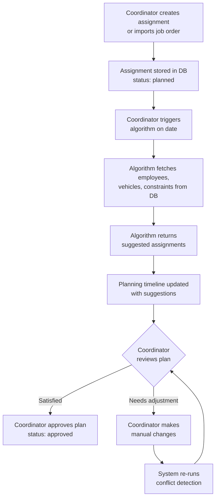
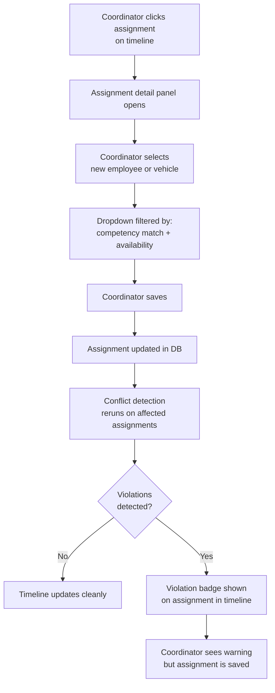
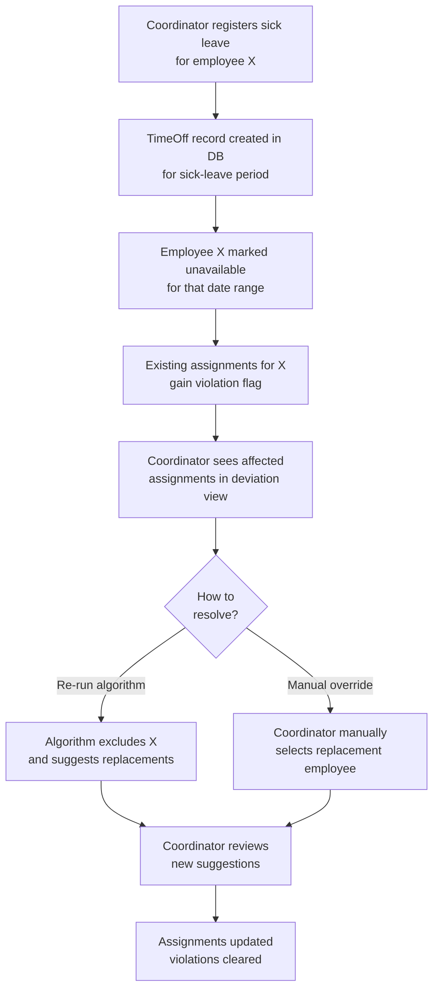
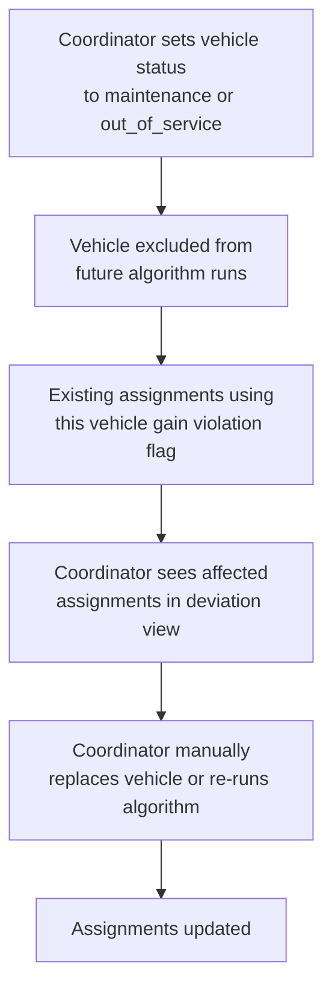
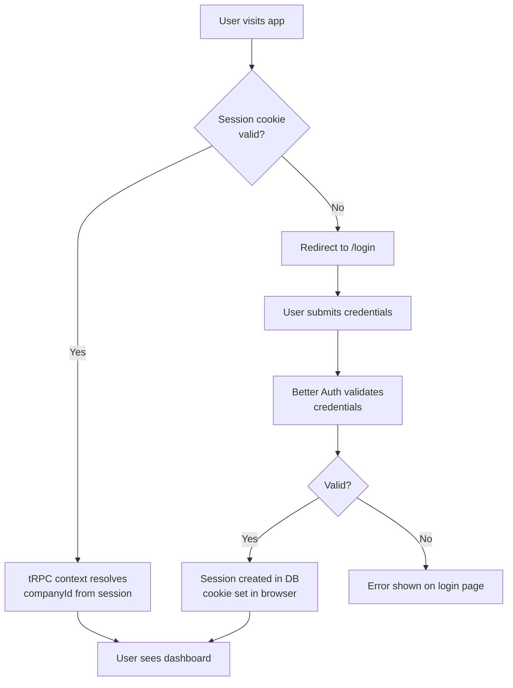

# System Flow Diagrams — Ressursplanlegger

> Describes the main operational flows in the system.
> Used in Chapter 4.4 (System Description) and Chapter 5.
> Owner: Embret — fill this before Chapter 4 is written.
> Use Mermaid syntax — renders in GitHub and can be referenced in the thesis as figures.

---

## Flow 1: Assignment to Confirmed Plan

> The main flow: how an assignment enters the system and ends up as a confirmed driver assignment.

An assignment is created by the coordinator (or imported) with a date, time window, required vehicle type, required competencies, and priority. The assignment is stored in the database with status `planned`. The coordinator then triggers the optimisation algorithm for that date. The algorithm returns a suggested employee and vehicle for each assignment. The coordinator reviews the suggestions on the planning timeline, makes any manual adjustments, and approves the plan. Assignments move to status `approved`.

---

## Flow 2: Manual Assignment Override

> What happens when the coordinator manually changes an algorithm-generated assignment.

The coordinator can override any algorithm suggestion at any time by clicking on an assignment in the timeline. A detail panel opens where the coordinator selects a different employee or vehicle. The available choices are filtered by competency match and availability. When the coordinator saves, the assignment is updated in the database and conflict detection reruns on the affected assignments. If a violation is detected (e.g. the selected employee is already occupied), a warning is shown — but the system does not block the save (soft-warning behaviour; the coordinator has final authority).

---

## Flow 3: Sick Leave Handling

> What happens when a driver calls in sick and their assignments need reassignment.

The coordinator registers a sick-leave period for the employee via the employee profile or the time-off management interface. The system marks the employee as unavailable for the sick-leave period. Assignments previously assigned to that employee and falling within the sick-leave window are not automatically reassigned — they remain assigned but gain a conflict flag (`missing_competence` or `incomplete` depending on whether the employee was the only match). The coordinator is notified of the affected assignments via the deviation view and can re-run the algorithm (which will now exclude the sick employee) or manually reassign.

---

## Flow 4: Vehicle Becomes Unavailable

> What happens when a vehicle breaks down or enters maintenance.

---

## Flow 5: Authentication

---

## Notes for Thesis Writing

- Each diagram above should become a `\begin{figure}` in the LaTeX chapter
- Caption format: "Figure 4.X: [Description of what the flow shows]"
- Label format: `\label{fig:flow-[name]}`
- Reference in text before the figure appears: `\Cref{fig:flow-[name]} illustrates...`
