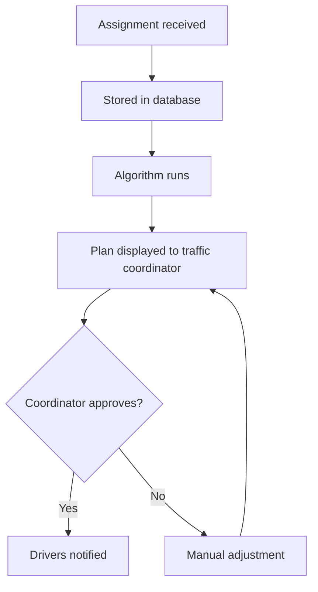
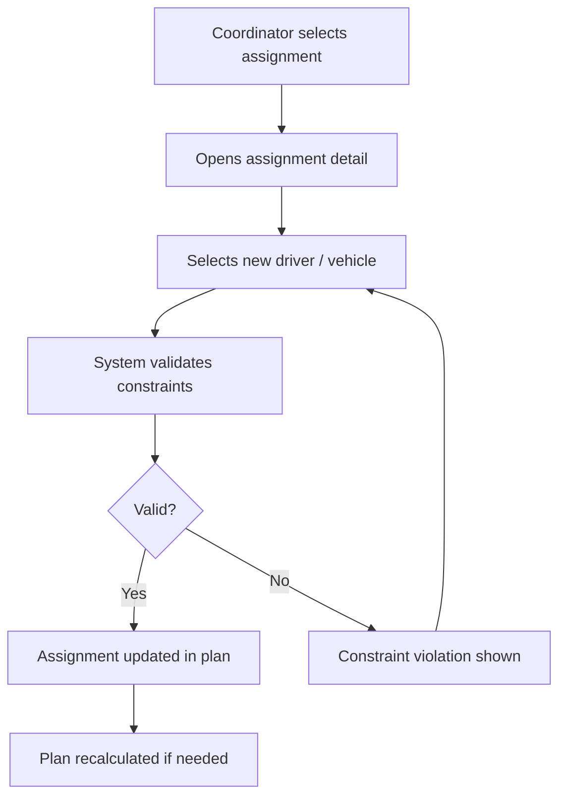
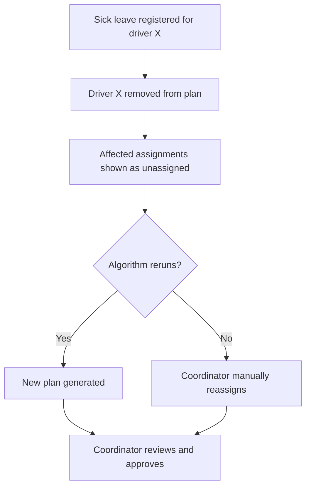

# System Flow Diagrams — Ressursplanlegger

> Describes the main operational flows in the system.
> Used in Chapter 4.4 (System Description) and Chapter 5.
> Owner: Embret — fill this before Chapter 4 is written.
> Use Mermaid syntax — renders in GitHub and can be referenced in the thesis as figures.

---

## Flow 1: Assignment to Confirmed Plan

> The main flow: how an assignment enters the system and ends up as a confirmed driver assignment.

[FILL IN — describe or draw the flow]

*[Replace with actual system flow once implemented — verify each step matches the real system]*

---

## Flow 2: Manual Assignment Override

> What happens when the traffic coordinator manually changes an algorithm-generated assignment.

[FILL IN]

*[Adjust to match actual implementation]*

---

## Flow 3: Sick Leave Handling

> What happens when a driver calls in sick and their assignments need reassignment.

[FILL IN]

*[Adjust to match actual implementation]*

---

## Additional Flows

[FILL IN any other significant flows — e.g., vehicle unavailability, multi-day planning, authentication]

---

## Notes for Thesis Writing

- Each diagram above should become a `\begin{figure}` in the LaTeX chapter
- Caption format: "Figure 4.X: [Description of what the flow shows]"
- Label format: `\label{fig:flow-[name]}`
- Reference in text before the figure appears: `\Cref{fig:flow-[name]} illustrates...`
